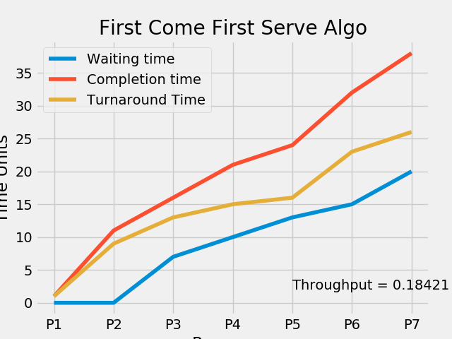
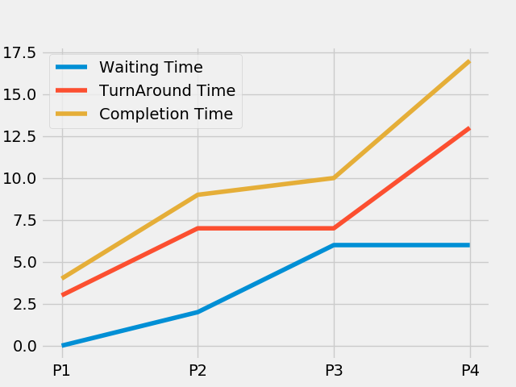
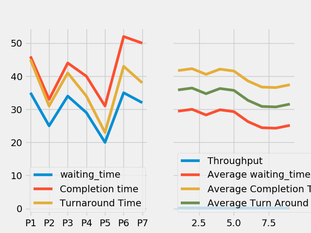

# CPU-Scheduling-Simluation
[](https://forthebadge.com)
[](https://forthebadge.com)
[](https://forthebadge.com)
[](https://forthebadge.com)

Simulate various CPU scheduling algorithms (FCFS, SJF-peemptive & nonpeemptive, Priority Scheduling-peemptive & nonpeemptive and Round Robin)

## Contributors

 - [Kashish Srivastava](https://github.com/cannibalcheeseburger) - 185014
 - [Dipesh Chopra](https://github.com/dopesh28) - 185015
 - [Akash Rana](https://github.com/akaxhrana) - 185034

## Contents

 - [Installation](#Installation)
 - [Title](#Title)
 - [Theory](#Theory)
   - [Types of Cpu Scheduling](#Types-of-CPU-Scheduling)
     - [Non-Preemptive Scheduling](#Non-Preemptive-Scheduling)
     - [Preemptive Scheduling](#Preemptive-Scheduling)
   - [First Come First Serve Scheduling (FCFS)](#First-Come-First-Serve-Scheduling)
   - [Shortest Job First Scheduling](#Shortest-Job-First-Scheduling)
   - [Priority Scheduling](#Priority-Scheduling)
   - [Round Robin Scheduling](#Round-Robin-Scheduling)

## Installation

 - [Python 3.7.6](https://www.python.org/downloads/)


 - Build from source

```
git clone https://github.com/cannibalcheeseburger/cpu-scheduling-simluation.git
cd cpu-scheduling-simulation
```


 - Requirements
```
python -m pip install -r requirements.txt
```

 - Running program
 ```
python main.py
 ```

## Title

Simulate various CPU scheduling algorithms (FCFS, SJF-peemptive & nonpeemptive, Priority Scheduling-peemptive & nonpeemptive and Round Robin). Run your simulator for each scheduling policy, with a variety of quantum values. For each version of the simulator, for each input data file, for each quantum value, plot the completion time, throughput, average job elapsed time and average job waiting time. Analyze the behavior of your scheduler.

## Theory

CPU scheduling is a process which allows one process to use the CPU while the execution of another process is on hold(in waiting state) due to unavailability of any resource like I/O etc, thereby making full use of CPU. The aim of CPU scheduling is to make the system efficient, fast and fair.

Whenever the CPU becomes idle, the operating system must select one of the processes in the ready queue to be executed. The selection process is carried out by the short-term scheduler (or CPU scheduler). The scheduler selects from among the processes in memory that are ready to execute, and allocates the CPU to one of them.

### Types of CPU Scheduling

CPU scheduling decisions may take place under the following four circumstances:

1. When a process switches from the running state to the waiting state(for I/O request or invocation of wait for the termination of one of the child processes).
2. When a process switches from the running state to the ready state (for example, when an interrupt occurs).
3. When a process switches from the waiting state to the ready state(for example, completion of I/O).
4. When a process terminates.

In circumstances 1 and 4, there is no choice in terms of scheduling. A new process(if one exists in the ready queue) must be selected for execution. There is a choice, however in circumstances 2 and 3.

When Scheduling takes place only under circumstances 1 and 4, we say the scheduling scheme is non-preemptive; otherwise the scheduling scheme is preemptive.

### Non-Preemptive Scheduling

Under non-preemptive scheduling, once the CPU has been allocated to a process, the process keeps the CPU until it releases the CPU either by terminating or by switching to the waiting state.

It is the only method that can be used on certain hardware platforms, because it does not require the special hardware(for example: a timer) needed for preemptive scheduling.

### Preemptive Scheduling

In this type of Scheduling, the tasks are usually assigned with priorities. At times it is necessary to run a certain task that has a higher priority before another task although it is running. Therefore, the running task is interrupted for some time and resumed later when the priority task has finished its execution.

### CPU Scheduling Algorithms

We will discuss about most used CPU Scheduling algorithms.

 1. First Come First Serve(FCFS)
 2. Shortest Job First(SJF)
 3. Priority Scheduling
 4. Round Robin

#### First Come First Serve Scheduling

In the "First come first serve" scheduling algorithm, as the name suggests, the process which arrives first, gets executed first, or we can say that the process which requests the CPU first, gets the CPU allocated first. First Come First Serve, is just like FIFO(First in First out) Queue data structure, where the data element which is added to the queue first, is the one who leaves the queue first. This is used in Batch Systems. It's easy to understand and implement programmatically, using a Queue data structure, where a new process enters through the tail of the queue, and the scheduler selects process from the head of the queue. FCFS provides an efficient, simple and error-free process scheduling algorithm that saves valuable CPU resources. It uses nonpreemptive scheduling in which a process is automatically queued and processing occurs according to an incoming request or process order. FCFS derives its concept from real-life customer service.



#### Shortest Job First Scheduling

Shortest job next (SJN), also known as shortest job first (SJF) or shortest process next (SPN), is a scheduling policy that selects for execution the waiting process with the smallest execution time. SJN is a non-preemptive algorithm. Shortest remaining time is a preemptive variant of SJN.

Shortest job next is advantageous because of its simplicity and because it minimizes the average amount of time each process has to wait until its execution is complete. However, it has the potential for process starvation for processes which will require a long time to complete if short processes are continually added. Highest response ratio next is similar but provides a solution to this problem using a technique called aging.

Another disadvantage of using shortest job next is that the total execution time of a job must be known before execution. While it is impossible to predict execution time perfectly, several methods can be used to estimate it, such as a weighted average of previous execution times.

Shortest job next can be effectively used with interactive processes which generally follow a pattern of alternating between waiting for a command and executing it. If the execution burst of a process is regarded as a separate "job", past behaviour can indicate which process to run next, based on an estimate of its running time.

#### Priority Scheduling 

Priority scheduling is a scheduling system commonly used in real-time systems. With fixed priority preemptive scheduling, the scheduler ensures that at any given time, the processor executes the highest priority task of all those tasks that are currently ready to execute.

The preemptive scheduler has a clock interrupt task that can provide the scheduler with options to switch after the task has had a given period to execute—the time slice. This scheduling system has the advantage of making sure no task hogs the processor for any time longer than the time slice. However, this scheduling scheme is vulnerable to process or thread lockout: since priority is given to higher-priority tasks, the lower-priority tasks could wait an indefinite amount of time. One common method of arbitrating this situation is aging, which gradually increments the priority of waiting processes and threads, ensuring that they will all eventually execute. Most real-time operating systems (RTOSs) have preemptive schedulers. Also turning off time slicing effectively gives you the non-preemptive RTOS.



#### Round Robin Scheduling

Round-robin (RR) is one of the algorithms employed by process and network schedulers in computing. As the term is generally used, time slices (also known as time quanta) are assigned to each process in equal portions and in circular order, handling all processes without priority (also known as cyclic executive). Round-robin scheduling is simple, easy to implement, and starvation-free. Round-robin scheduling can be applied to other scheduling problems, such as data packet scheduling in computer networks. It is an operating system concept.




## Usage

Run The Script
```
python main.py
```

Enter your Choice and press enter
```
=============== MAIN MENU ===============

Analyse Performance Of Scheduling Algorithms:

1.First Come First Serve (FCFS)

2.Shortest Job First (SJF) -- PREEMPTIVE

3.Shortest Job First (SJF) -- NON PREEMPTIVE

4.Priority Scheduling -- PREEMPTIVE

5.Priority Scheduling -- NON PREEMPTIVE

6.Round Robin

7.ALL OF THE ABOVE AND COMPARE

0.Exit


ENTER YOUR OPTION:
```

Enter the values to be inputted into the algo corresponding to name of algo
in the main menu, located at `./inputs` folder. Values must be space separated.

Eg. input file - `Compare.txt`
```
PID Burst_time Arrival_time Priority
P1 3 6 3
P2 5 2 4
P3 1 3 1
P4 7 1 2
P5 4 5 8
```
Output will be print on console and graph will popup.
Output graph will also be save in `./output` folder.

Eg. output for FCFS.
```
Processes   Burst Time   Arrival Time     Waiting Time   Turn-Around Time  Completion Time 

  P1             1               0               0                1               1        
  P2             9               2               0                9               11       
  P3             6               3               7                13              16       
  P4             5               6               10               15              21       
  P5             3               8               13               16              24       
  P6             8               9               15               23              32       
  P7             6               12              20               26              38       
Average waiting time = 9.28571

Average turn around time =  14.714285714285714

Throughput =  0.18421052631578946
```

Eg. Output graph saved at `./output/Compare.png`


